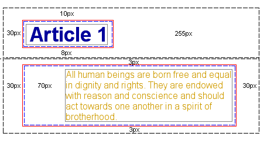
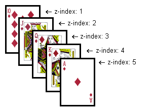

# CSS
访问[php.xitongxue.com观看课程](http://xitongxue.com)
关注我们的ＱＱ群：390536187

##CSS简介
###CSS是什么？
CSS是Cascading Style Sheets（级联样式表）的缩写。

###CSS做什么？
CSS是一种样式表语言，用于为HTML文档定义布局。例如，CSS涉及字体、颜色、边距、高度、宽度、背景图像、高级定位等方面。

###CSS有哪些好处？
－通过单个样式表控制多个文档的布局；
－更精确的布局控制；
－响应式布局；

##CSS的工作原理
````
selector { property : value }

选择器　　　属性　　　　　值

````
如:
````
body {background-color: #FF0000;}

````
但是把CSS代码放在哪里呢？

－方法1：行内样式表（style属性）

````
	<html>
	  <head>
	  <title>例子</title>
	  </head>
	  <body style="background-color: #FF0000;">
	  </body>
	</html>
````
－方法2：内部样式表（style元素）
````
	<html>
	  <head>
	  <title>例子</title>
	  <style>
		  body {background-color: #FF0000;}
	  </style>
	  </head>
	  <body>
	  </body>
	</html>
````	
－方法3：外部样式表（引用一个样式表文件）

````
	<html>
	  <head>
	<title>我的文档</title>
		<link rel="stylesheet" type="text/css" href="style/style.css" />
	  </head>
	  <body>
````

##CSS样式
###颜色与背景
- color    (字体颜色)
	- color: #000;
- background-color    (背景色)
	- background-color: #006666;
- background-image    (背景图像)
	- background-image: url("demo.jpg");
- background-repeat    (平铺背景图像)
	- background-repeat:repeat-x (图像横向平铺)
	- background-repeat:repeat-y (图像纵向平铺)
	- background-repeat:repeat (图像横向和纵向都平铺)
	- background-repeat:no-repeat (图像不平铺)
- background-attachment    (固定背景图像)
	－background-attachment:scroll　(非固定的)
	－background-attachment:fixed  (图像是固定在屏幕上的	)
- background-position    (放置背景图像)
	- background-position:top right
	- background-position:100px 100px
	- background-position:50% 50% 
- background    (缩写)
	- background: #FFCC66 url("butterfly.gif") no-repeat fixed right bottom;
	- background: #FFCC66 url("butterfly.gif") no-repeat; (如果省略某个属性不写出来，那么将自动为它取缺省值。)

###字体
- font-family (字体族)
- font-style (字体样式)
- font-weight (字体浓淡)
- font-size (字体大小)
- font (缩写)

###文本
- text-indent(文本缩进)
- text-align(文本对齐)
- text-decoration(文本装饰)
- letter-spacing(字符间距)
- text-transform(文本转换)

###链接

####伪类是什么？
伪类令你可以在为HTML元素定义CSS属性的时候将条件和事件考虑在内。

- a:link (未访问过的链接)
- a:visited(已访问过的链接)
- a:active(获得当前焦点的链接)
- a:hover (鼠标悬停的链接)

###列表
－list-style

###表格

- border 
- border-collapse (边框折叠为单一边框)

##CSS元素选择器

###类选择器
- CSS 类选择器
- CSS 多类选择器

 ````
.title {color:red;}
.big { font-size:50px; }

<h1 class="title big">学习PHP请到 <a href="#">系统学</a> 官网</h1>
````


###id选择器

####ID 选择器
- 只能在文档中使用一次
- ID 选择器不能结合使用
- 区分大小写

 ````
#title {color:red;}

<h1 id="title">学习PHP请到 <a href="#">系统学</a> 官网</h1>
````

###后代选择器

后代选择器可以选择作为某元素后代的元素。

 ````
h1 a {color:red;}
.title a {color:red;}

<h1 class="title">学习PHP请到 <a href="#">系统学</a> 官网</h1>

````

###子元素选择器

与后代选择器相比，子元素选择器只能选择作为某元素子元素的元素。

 ````
h1 > a {color:red;}
.title > a {color:red;}

h1 > p > a {color:green;}

<h1 class="title">学习PHP请到 <a href="#">系统学</a> 官网</h1>
<h1 class="title">学习PHP请到 <p><a href="#">系统学</a></p>官网</h1>

````

##组织元素div与span

###span组织元素
span元素可以说是一种中性元素，因为它不对文档本身添加任何东西。但是与CSS结合使用的话，span可以对文档中的部分文本增添视觉效果.

 ````
.text-danger {color:red;}

<h1 class="title">学习 <span class="text-danger">PHP</span> 请到 <span class="text-danger">系统学</span> 官网</h1>

````

###div组织元素
span的使用局限在一个块元素内，而div可以被用来组织一个或多个块元素.


 ````
.text-danger {color:red;}

.content-1 {
	
	background-color:bule;	
	height:200px;
}

.content-2 {
	
	background-color:green;
	height:400px;	
}

<div class="content-1">
<h1 class="title">学习 <span class="text-danger">PHP</span> 请到 <span class="text-danger">系统学</span> 官网</h1>
</div>

<div class="content-2">
<h1 class="title">学习 <span class="text-danger">PHP</span> 请到 <span class="text-danger">系统学</span> 官网</h1>
<p>HTML＋CSS课程</p>
</div>
````

##CSS盒模型

###盒模型
CSS中的盒状模型（box model）用于描述一个为HTML元素形成的矩形盒子。盒状模型还涉及为各个元素调整外边距（margin）、边框（border）、内边距（padding）和内容的具体操作。下图显示了盒状模型的结构：


这个例子包含了两个元素：h1和p。这两个元素的盒状模型如下图所示：




###边框

- border-width (边框宽度)
- border-color (边框颜色)
- border-style (边框样式)

###外边距
####为元素设置外边距
一个元素的边框到相邻元素(或者文档边界)之间的距离。

````
margin-top:100px;
margin-right:40px;
margin-bottom:10px;
margin-left:70px;

//缩写
margin: 100px 40px 10px 70px;
````
###内边距
####为元素设置内边距
内边距并不影响元素间的距离，它只定义元素的内容与元素边框之间的距离。

````
padding-top:20px;
padding-right:20px;
padding-bottom:20px;
padding-left:80px;

padding: 20px 20px 20px 80px;
````

##CSS定位
###定位原理
把浏览器窗口想象成一个坐标系统：

CSS定位的原理是：你可以将任何盒子（box）放置在坐标系统的任何位置上。

###绝对定位
一个采用绝对定位的元素不获得任何空间。这意味着：该元素在被定位后不会留下空位。

要对元素进行绝对定位，应将position属性的值设为absolute。接着，你可以通过属性left、right、top和bottom来设定将盒子放置在哪里。

###相对定位

要对元素进行相对定位，应将position属性的值设为relative。

采用相对定位的元素，其位置是相对于它在文档中的原始位置计算而来的。

##CSS浮动与层叠
###浮动

- float

````
.picture {
	
	float:left;
	width:100px;
}

.clear-fix {
	
	clear:both;
}

<div class="picture"></div>

<h1>浮动效果</h1>
<p class="clear-fix">这里是正文这里是正文这里是正文这里是正文这里是正文这里是正文
这里是正文这里是正文这里是正文这里是正文这里是正文这里是正文这里是正文这里是正文这里是正文
这里是正文这里是正文这里是正文这里是正文这里是正文这里是正文这里是正文
</p>
````

###层叠

- z-index
CSS可以处理高度、宽度、深度三个维度。

